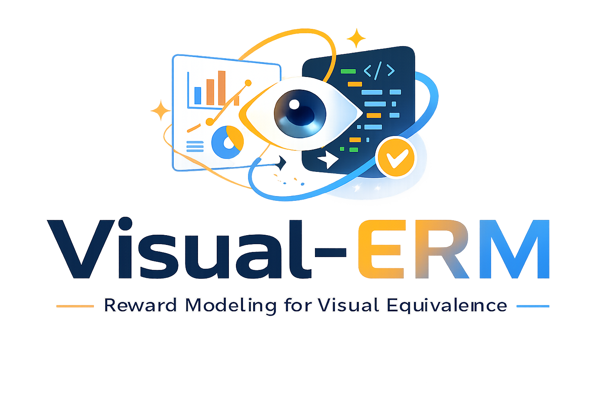
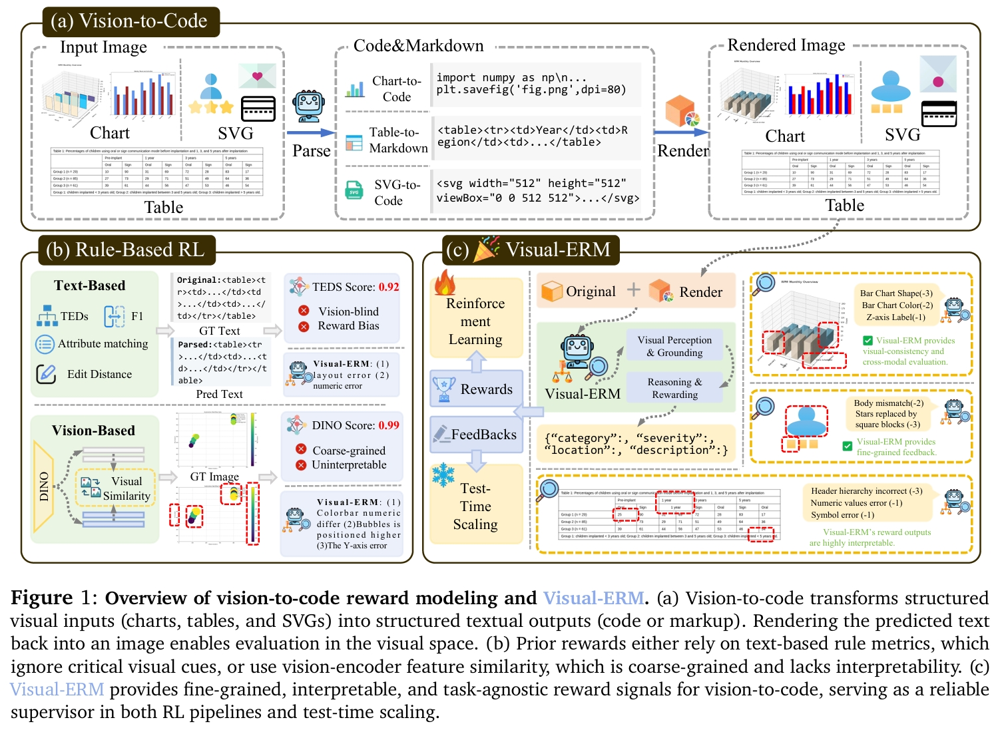
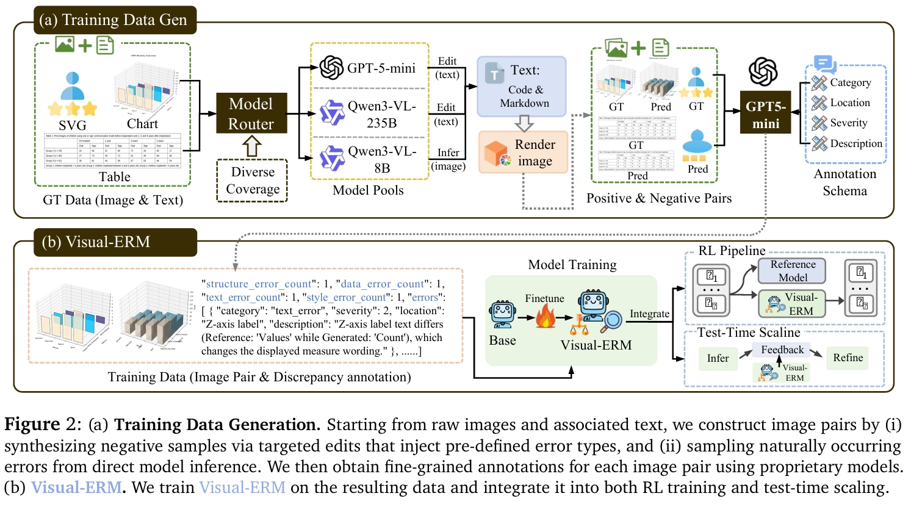
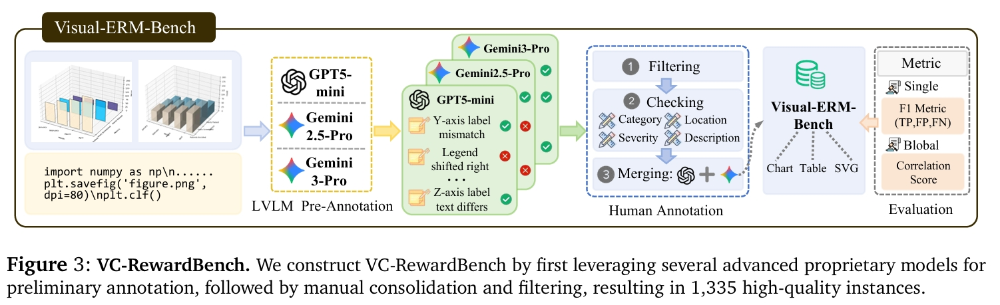

<p align="center">
  
</p>
<h1 align="center">Visual-ERM: Reward Modeling for Visual Equivalence</h1>

<p align="center">
  <a href="[TODO: arXiv link]">📄 Paper</a> |
  <a href="https://huggingface.co/internlm/Visual-ERM">🤗 Models</a> |
  <!-- <a href="[TODO: dataset link]">📦 Data</a> | -->
  <a href="https://huggingface.co/datasets/internlm/VC-RewardBench">📊 VC-RewardBench</a>
</p>

🌈 Official repository for **Visual-ERM**, a multimodal generative reward model for **vision-to-code** tasks.  
Visual-ERM evaluates outputs directly in the **rendered visual space** and provides **fine-grained**, **interpretable**, and **task-agnostic** feedback for structured visual reconstruction, including **chart-to-code**, **table-to-markdown**, and **SVG-to-code**.

## 📢 News

- 🚀 **[2026/03/15]** Release of <a href="https://huggingface.co/datasets/internlm/VC-RewardBench">📊 VisualCritic-RewardBench</a>.
- 🚀 **[2026/03/14]** Release of pretrained Visual-ERM <a href="https://huggingface.co/internlm/Visual-ERM">🤗 checkpoints</a>.
- 🚀 **[2026/03/13]** Initial release of Visual-ERM codebase.

## 💡 Highlights

- 🔥 **Visual-space reward modeling.** Instead of relying on text-only rules or coarse visual embedding similarity, Visual-ERM evaluates predictions in the rendered visual space.

- 🔥 **Fine-grained and interpretable feedback.** Visual-ERM predicts structured discrepancies with fields such as **category**, **severity**, **location**, and **description**, making reward signals actionable for both training and refinement.

- 🔥 **Task-agnostic reward supervision.** A single reward model generalizes across multiple vision-to-code tasks, including charts, tables, and SVGs.

- 🔥 **Effective for both RL and test-time scaling.** Visual-ERM can be used as a reward model in RL and as a visual critic for reflection-and-revision at inference time.

- 🔥 **A new benchmark for visual discrepancy judgment.** We introduce **VC-RewardBench**, a benchmark for fine-grained image-to-image discrepancy evaluation on structured visual data.

## 👀 Overview

Vision-to-code tasks require models to reconstruct structured visual inputs into executable or structured representations with high visual fidelity. However, existing reward designs have major limitations: **(1) Text-based rewards** (e.g., edit distance, TEDS) ignore important visual cues such as layout, alignment, spacing, and style. **(2) Vision embedding rewards** (e.g., DINO similarity) are often coarse-grained, semantically biased, and vulnerable to reward hacking.

To address this, we propose **Visual Equivalence Reward Model (Visual-ERM)**, a multimodal generative reward model that compares the **ground-truth image** and the **rendered image** from a model prediction, and then outputs fine-grained discrepancy annotations that can be converted into reward signals or used for reflection-based refinement.

<p align="center">
  
</p>

## 🔬 Framework

Visual-ERM consists of three major components:

1. **Reward data generation**  
   We construct image pairs by: (1) editing ground-truth structured outputs to inject controlled errors, and (2) sampling natural errors from weaker model predictions.

2. **Fine-grained discrepancy annotation**  
   Each image pair is annotated with structured visual discrepancies, including: category, severity, location and description

3. **Integration into RL and test-time scaling**  
   Visual-ERM can be used: (1) as a **reward model** for GRPO-based RL, and (2) as a **visual critic** for iterative reflection and revision during inference.

<p align="center">
  
</p>

## 📋 Main Results

**Reinforcement Learning.** Visual-ERM consistently improves vision-to-code performance across multiple tasks by providing feedback signals as a reward model during RL.

- **Chart-to-Code**: improves **Qwen3-VL-8B-Instruct** by **+8.4** on average.
- **Table-to-Markdown**: yields **+2.7** average improvement.
- **SVG-to-Code**: yields **+4.1** average improvement.

**Visual Critic Benchmark:** On **VC-RewardBench**, Visual-ERM substantially improves over the base model on fine-grained discrepancy judgment and outperforms **Qwen3-VL-235B-Instruct** as an open-source judge.

## 📍 VC-RewardBench

We introduce **VisualCritic-RewardBench (VC-RewardBench)**, a benchmark for evaluating fine-grained image-to-image discrepancy judgment on structured visual data.

<p align="center">
  
</p>

### Benchmark Features

- Covers **charts**, **tables**, and **SVGs**
- Contains **1,335** carefully curated instances
- Each instance includes:
  - a ground-truth image
  - a corrupted / rendered counterpart
  - fine-grained discrepancy annotations

## 🔓 Quick Start

### 1. Reward Inference

Use Visual-ERM to compare a reference image and a rendered prediction. First, download the model weights from Hugging Face:

- 🤗 [Visual-ERM Model Weights](https://huggingface.co/internlm/Visual-ERM)

Visual-ERM is fine-tuned from [Qwen3-VL-8B-Instruct](https://huggingface.co/Qwen/Qwen3-VL-8B-Instruct), so the usage is fully compatible with Qwen3-VL-8B-Instruct. Please refer to the supplementary materials of our paper for prompt templates.

### 2. RL with Visual-ERM

We use [veRL](https://github.com/volcengine/verl) as the RL training framework. Before starting RL training, launch a reward model (Visual-ERM) service via vLLM:

```bash
CUDA_VISIBLE_DEVICES=0,1,2,3 vllm serve "$MODEL_PATH" \
  --tensor-parallel-size 4 \
  --served-model-name $SERVE_NAME \
  --port $PORT \
  --max-num-seqs $N_PROC
```

> You may need to launch multiple vLLM services to speed up reward computation. vLLM service can be set in reward functions as show in `rl_scripts/reward_func/table_parse_rm_v2.py`.

Then start RL training with the following script:

```bash
bash ./rl_scripts/run_qwen3vl_table_40k_rm_32gpus.sh
```

RL training data can be freely organized following the veRL data format. Taking the **table-to-markdown** task as an example, the training data contains table images (no parsed markdown is needed). During training, the reward function renders the markdown parsed by the policy model back into an image, then feeds both the rendered image and the ground-truth image into Visual-ERM to produce a reward score (see the framework figure above). An example reward function is provided at `rl_scripts/reward_func/table_parse_rm_v2.py`.

### 3. Evaluation on VisualCritic-RewardBench

First, download the VC-RewardBench data from <a href="https://huggingface.co/datasets/internlm/VC-RewardBench">📊 Hugging Face</a>. Then use `./evaluation/api_judge.py` to generate model responses (this serves as an example of API-based inference). After inference, the output JSONL will contain two additional fields: `pred_json` and `error_parse_failed_reason`. Finally, run `./evaluation/evaluation.py` to produce a JSON file with the evaluation results.

> Note: You need to specify the API key and model type in the Python files, and update the corresponding benchmark JSONL file path accordingly.

## ❓ Why Visual-ERM?

Visual-ERM is designed for settings where **visual equivalence matters more than textual similarity**.

It is particularly useful when:
- semantic similarity is not sufficient,
- reward hacking is common under proxy rewards,
- test-time self-correction requires interpretable visual feedback.

## ✒️ Citation

If you find this work useful, please consider citing:

```bibtex
TBD
```

---

If you are interested in **visual reward modeling**, **vision-to-code**, or **reinforcement learning for multimodal models**, feel free to communicate with us.
